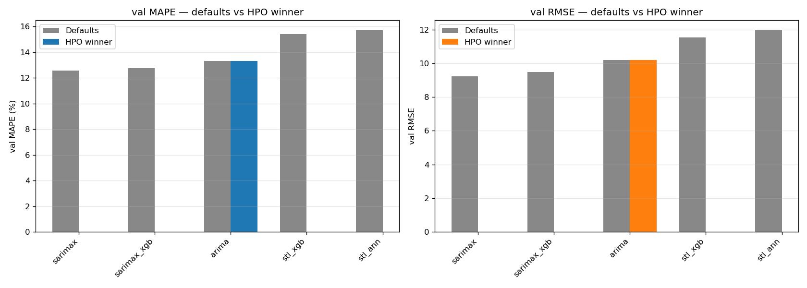
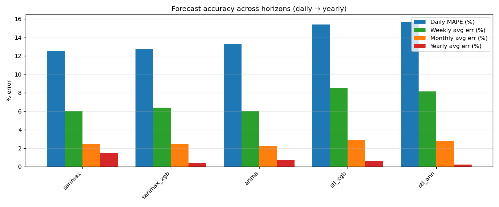
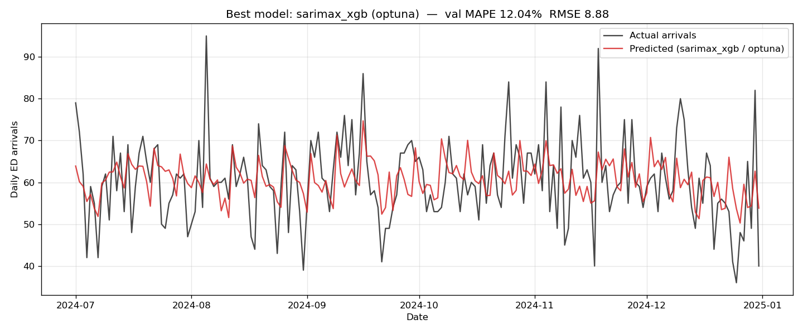
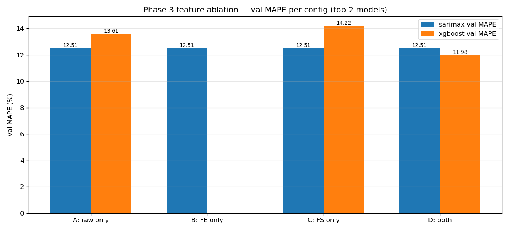

# Master Model Comparison Report

This report consolidates Phases 1, 2, and 3 of the Task-1 (daily ED arrivals) forecasting experiment.

## Phase 1 — Chapter 5 defaults (no HPO)

| model        |   cv_avg_RMSE |   cv_avg_MAPE |   val_MAPE |   val_MAE |   val_RMSE |   val_R2 |   weekly_avg_pct_error |   monthly_avg_pct_error |   yearly_avg_pct_error |
|:-------------|--------------:|--------------:|-----------:|----------:|-----------:|---------:|-----------------------:|------------------------:|-----------------------:|
| sarimax      |         8.382 |        12.339 |     12.582 |     7.211 |      9.222 |    0.135 |                  6.067 |                   2.415 |                  1.467 |
| sarimax_xgb  |        10.668 |        15.338 |     12.753 |     7.383 |      9.492 |    0.083 |                  6.398 |                   2.469 |                  0.381 |
| xgboost      |         9.893 |        13.663 |     13.044 |     7.669 |      9.873 |    0.008 |                  5.118 |                   1.417 |                  0.681 |
| ann          |         9.936 |        13.537 |     13.452 |     7.905 |     10.004 |   -0.018 |                  4.983 |                   2.991 |                  1.470 |
| arima        |         8.927 |        12.439 |     13.324 |     7.798 |     10.195 |   -0.058 |                  6.064 |                   2.254 |                  0.762 |
| lstm_xgb     |         7.556 |        10.481 |     15.505 |     9.019 |     11.381 |   -0.318 |                  7.261 |                   1.723 |                  1.124 |
| lstm         |         7.545 |        10.125 |     15.591 |     9.055 |     11.395 |   -0.321 |                  6.992 |                   2.147 |                  1.142 |
| sarimax_lstm |         7.569 |        10.492 |     16.031 |     9.358 |     11.484 |   -0.342 |                  6.217 |                   1.803 |                  0.535 |
| stl_xgb      |        13.871 |        18.718 |     15.405 |     9.018 |     11.540 |   -0.355 |                  8.515 |                   2.867 |                  0.648 |
| stl_ann      |        12.900 |        17.671 |     15.703 |     9.136 |     11.955 |   -0.454 |                  8.152 |                   2.777 |                  0.241 |
| stl_lstm     |         9.366 |        12.734 |     17.937 |    10.485 |     13.479 |   -0.849 |                  9.047 |                   3.053 |                  0.343 |

## Phase 2 — HPO targeting minimum RMSE

| model        | algo             |   n_trials |   cv_RMSE |   cv_MAPE |   cv_MAE |   val_MAPE |   val_MAE |   val_RMSE |   val_R2 | winner_params                                                                                                                           |
|:-------------|:-----------------|-----------:|----------:|----------:|---------:|-----------:|----------:|-----------:|---------:|:----------------------------------------------------------------------------------------------------------------------------------------|
| sarimax_xgb  | optuna           |         10 |     7.475 |    10.009 |    6.093 |     12.045 |     7.000 |      8.878 |    0.198 | {"n_estimators": 100, "max_depth": 5, "learning_rate": 0.015144860262751412, "subsample": 0.848553073033381}                            |
| sarimax      | auto_arima       |          1 |     7.218 |    10.064 |    6.111 |     12.341 |     7.094 |      8.984 |    0.179 | {"order": [1, 1, 1], "seasonal_order": [0, 1, 1, 7]}                                                                                    |
| sarimax_lstm | rmse_tuned_proxy |          0 |   nan     |   nan     |  nan     |     12.191 |     7.060 |      9.047 |    0.167 | see artefacts/metrics/hybrid_sarimax_lstm_rmse_metrics.csv                                                                              |
| ann          | grid             |         10 |     7.408 |     9.664 |    6.039 |     12.322 |     7.152 |      9.244 |    0.130 | {"hidden_layers": 1, "units": 64, "dropout": 0.2, "learning_rate": 0.001, "batch_size": 32, "seed": 42}                                 |
| xgboost      | optuna           |         10 |     7.198 |     9.512 |    5.851 |     11.956 |     7.073 |      9.390 |    0.103 | {"n_estimators": 200, "max_depth": 3, "learning_rate": 0.01699897838270077, "subsample": 0.7174250836504598}                            |
| xgboost      | random           |         10 |     7.061 |     9.116 |    5.617 |     11.970 |     7.081 |      9.401 |    0.101 | {"n_estimators": 200, "max_depth": 3, "learning_rate": 0.01690068425265491, "subsample": 0.9049146859727364}                            |
| xgboost      | grid             |         10 |     7.169 |     9.406 |    5.766 |     11.988 |     7.104 |      9.433 |    0.095 | {"n_estimators": 300, "max_depth": 3, "learning_rate": 0.01, "subsample": 0.85}                                                         |
| ann          | random           |         10 |     7.264 |     9.440 |    5.868 |     12.615 |     7.389 |      9.617 |    0.059 | {"hidden_layers": 2, "units": 256, "dropout": 0.3358192915830862, "learning_rate": 0.0001803961503006787, "batch_size": 32, "seed": 42} |
| ann          | optuna           |         10 |     6.988 |     9.224 |    5.699 |     12.800 |     7.431 |      9.637 |    0.055 | {"hidden_layers": 2, "units": 192, "dropout": 0.2075397185632818, "learning_rate": 0.0001705053926026929, "batch_size": 32, "seed": 42} |
| arima        | auto_arima       |          1 |     7.791 |    10.035 |    6.330 |     13.326 |     7.798 |     10.198 |   -0.058 | {"order": [0, 1, 2], "seasonal_order": null}                                                                                            |
| lstm         | optuna           |         10 |     6.915 |     9.002 |    5.585 |     13.823 |     7.940 |     10.279 |   -0.075 | {"lookback": 21, "units": 192, "dropout": 0.2570351922786027, "learning_rate": 0.00021839352923182988, "batch_size": 32, "seed": 42}    |
| lstm         | random           |         10 |     7.011 |     9.349 |    5.704 |     15.095 |     8.757 |     10.895 |   -0.208 | {"lookback": 21, "units": 128, "dropout": 0.26455232265416595, "learning_rate": 0.000566692445689169, "batch_size": 32, "seed": 42}     |
| stl_ann      | optuna           |         10 |     9.293 |    12.748 |    7.760 |     14.985 |     8.694 |     11.303 |   -0.300 | {"hidden_layers": 2, "units": 192, "dropout": 0.2075397185632818, "learning_rate": 0.0001705053926026929, "batch_size": 32, "seed": 42} |
| stl_xgb      | optuna           |         10 |     9.335 |    12.814 |    7.742 |     15.276 |     8.973 |     11.326 |   -0.305 | {"n_estimators": 200, "max_depth": 8, "learning_rate": 0.0764136186923332, "subsample": 0.976562270506935}                              |
| lstm         | grid             |          8 |     7.269 |    10.220 |    5.996 |     15.961 |     9.242 |     11.739 |   -0.402 | {"lookback": 7, "units": 128, "dropout": 0.2, "learning_rate": 0.001, "batch_size": 32, "seed": 42}                                     |
| stl_lstm     | optuna           |         10 |     7.903 |    11.385 |    6.660 |     16.423 |     9.668 |     12.278 |   -0.534 | {"lookback": 7, "units": 128, "dropout": 0.2774425485152653, "learning_rate": 0.0006342770438858341, "batch_size": 32, "seed": 42}      |
| lstm_xgb     | rmse_tuned_proxy |          0 |   nan     |   nan     |  nan     |     31.268 |    17.130 |     19.132 |   -2.725 | see artefacts/metrics/hybrid_lstm_xgb_rmse_metrics.csv                                                                                  |

## Master comparison — defaults vs HPO winner

| model        |   defaults_cv_RMSE |   defaults_cv_MAPE |   defaults_val_MAPE |   defaults_val_RMSE |   defaults_val_R2 |   defaults_yearly_pct | hpo_algo         |   hpo_cv_RMSE |   hpo_cv_MAPE |   hpo_val_MAPE |   hpo_val_RMSE |   hpo_val_R2 |   delta_MAPE_pp |   delta_RMSE |
|:-------------|-------------------:|-------------------:|--------------------:|--------------------:|------------------:|----------------------:|:-----------------|--------------:|--------------:|---------------:|---------------:|-------------:|----------------:|-------------:|
| sarimax      |              8.382 |             12.339 |              12.582 |               9.222 |             0.135 |                 1.467 | auto_arima       |         7.218 |        10.064 |         12.341 |          8.984 |        0.179 |          -0.242 |       -0.238 |
| sarimax_xgb  |             10.668 |             15.338 |              12.753 |               9.492 |             0.083 |                 0.381 | optuna           |         7.475 |        10.009 |         12.045 |          8.878 |        0.198 |          -0.708 |       -0.615 |
| xgboost      |              9.893 |             13.663 |              13.044 |               9.873 |             0.008 |                 0.681 | optuna           |         7.198 |         9.512 |         11.956 |          9.390 |        0.103 |          -1.088 |       -0.483 |
| ann          |              9.936 |             13.537 |              13.452 |              10.004 |            -0.018 |                 1.470 | grid             |         7.408 |         9.664 |         12.322 |          9.244 |        0.130 |          -1.130 |       -0.760 |
| arima        |              8.927 |             12.439 |              13.324 |              10.195 |            -0.058 |                 0.762 | auto_arima       |         7.791 |        10.035 |         13.326 |         10.198 |       -0.058 |           0.002 |        0.002 |
| lstm_xgb     |              7.556 |             10.481 |              15.505 |              11.381 |            -0.318 |                 1.124 | rmse_tuned_proxy |       nan     |       nan     |         31.268 |         19.132 |       -2.725 |          15.763 |        7.751 |
| lstm         |              7.545 |             10.125 |              15.591 |              11.395 |            -0.321 |                 1.142 | optuna           |         6.915 |         9.002 |         13.823 |         10.279 |       -0.075 |          -1.767 |       -1.116 |
| sarimax_lstm |              7.569 |             10.492 |              16.031 |              11.484 |            -0.342 |                 0.535 | rmse_tuned_proxy |       nan     |       nan     |         12.191 |          9.047 |        0.167 |          -3.840 |       -2.438 |
| stl_xgb      |             13.871 |             18.718 |              15.405 |              11.540 |            -0.355 |                 0.648 | optuna           |         9.335 |        12.814 |         15.276 |         11.326 |       -0.305 |          -0.128 |       -0.214 |
| stl_ann      |             12.900 |             17.671 |              15.703 |              11.955 |            -0.454 |                 0.241 | optuna           |         9.293 |        12.748 |         14.985 |         11.303 |       -0.300 |          -0.717 |       -0.653 |
| stl_lstm     |              9.366 |             12.734 |              17.937 |              13.479 |            -0.849 |                 0.343 | optuna           |         7.903 |        11.385 |         16.423 |         12.278 |       -0.534 |          -1.514 |       -1.202 |

## Phase 3 — Feature ablation (top-2 models)

| model   | config       |   n_features |   cv_RMSE |   cv_MAPE |   val_MAPE |   val_MAE |   val_RMSE |   val_R2 |   weekly_avg_pct |   monthly_avg_pct |   yearly_avg_pct |
|:--------|:-------------|-------------:|----------:|----------:|-----------:|----------:|-----------:|---------:|-----------------:|------------------:|-----------------:|
| sarimax | A_raw_only   |           15 |     8.168 |    12.111 |     12.510 |     7.147 |      9.133 |    0.151 |            5.891 |             2.561 |            1.866 |
| sarimax | B_engineered |           99 |     8.168 |    12.111 |     12.510 |     7.147 |      9.133 |    0.151 |            5.891 |             2.561 |            1.866 |
| sarimax | C_selection  |            1 |     8.168 |    12.111 |     12.510 |     7.147 |      9.133 |    0.151 |            5.891 |             2.561 |            1.866 |
| sarimax | D_both       |           23 |     8.168 |    12.111 |     12.510 |     7.147 |      9.133 |    0.151 |            5.891 |             2.561 |            1.866 |
| xgboost | A_raw_only   |           15 |     8.596 |    12.747 |     13.610 |     8.566 |     10.857 |   -0.200 |            9.554 |             9.155 |            9.166 |
| xgboost | C_selection  |            1 |     8.791 |    13.265 |     14.216 |     8.993 |     11.483 |   -0.342 |           10.314 |             9.893 |            9.929 |
| xgboost | D_both       |           23 |     8.340 |    11.902 |     11.985 |     7.092 |      9.394 |    0.102 |            4.146 |             2.292 |            1.667 |

## Figures

- 
- 
- 
- 
